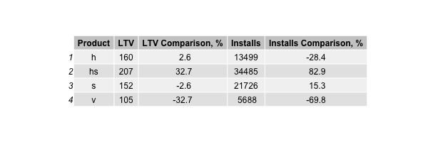
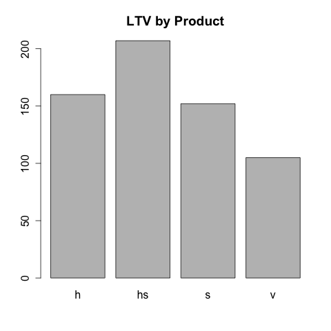
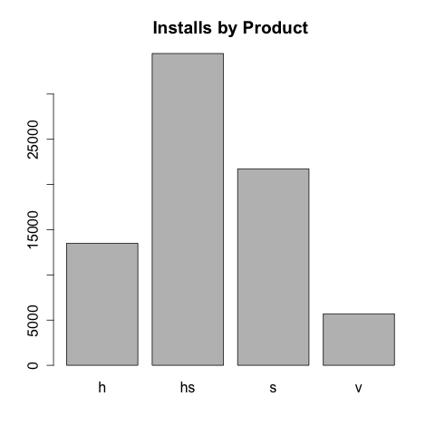
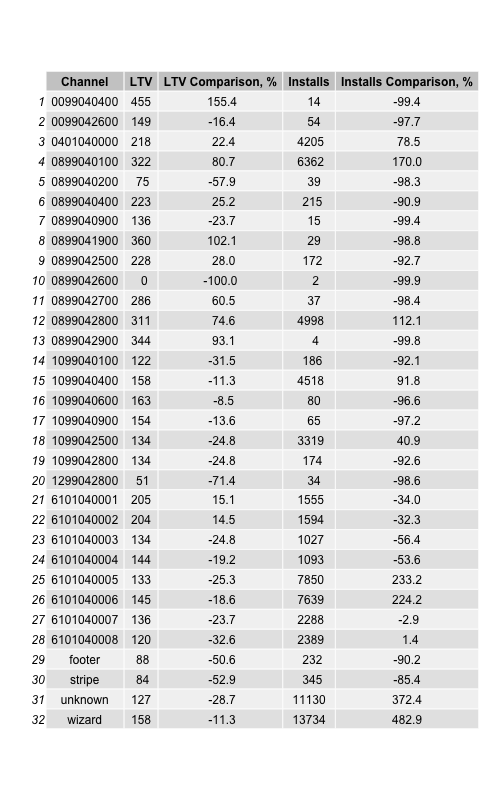
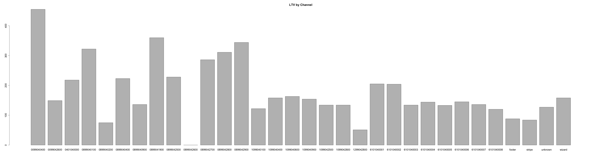
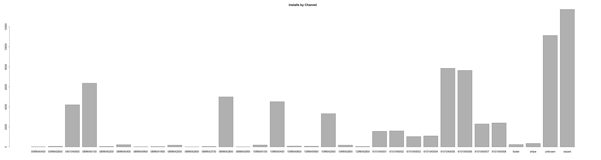

# Аналитическое задание

## Установка
Инструмент написан на R. Для запуска нужно установить:
* [R](https://cran.rstudio.com/)
* [RStudio](https://www.rstudio.com/products/rstudio/download/)

## Использование
Скрипт **ltv_tool.R** скачивает данные из Github и создает несколько графиков, примеры которых есть ниже.

Его можно доработать на закачку данных из другого источника.

## Графики из исследования

